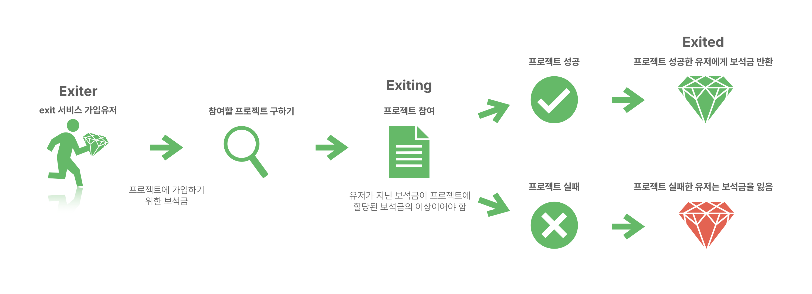
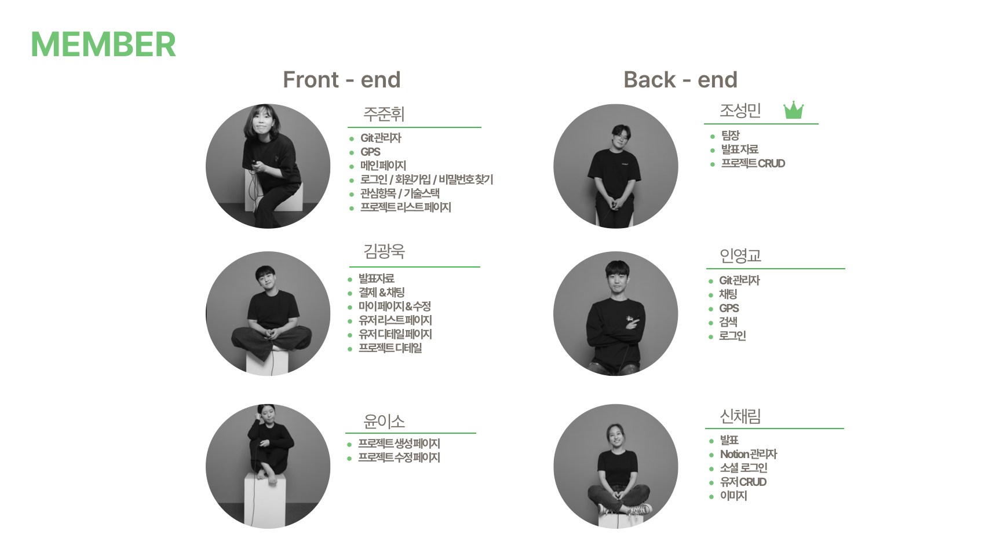
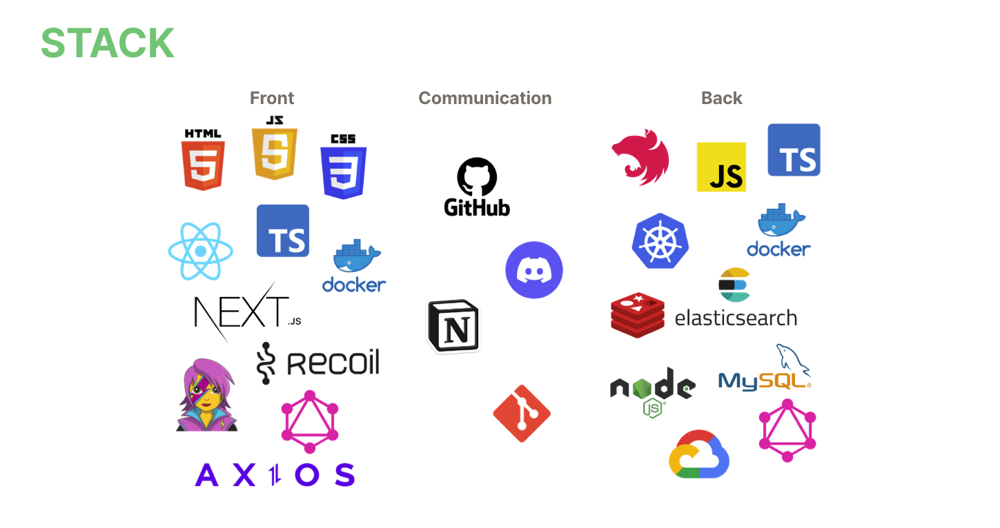
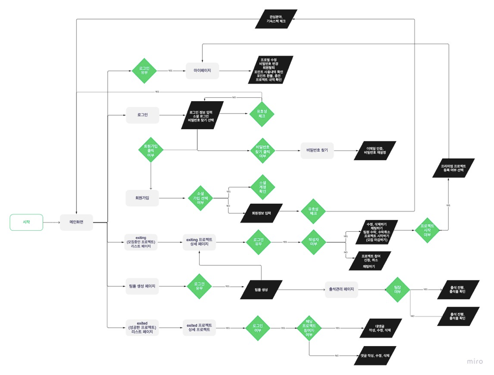
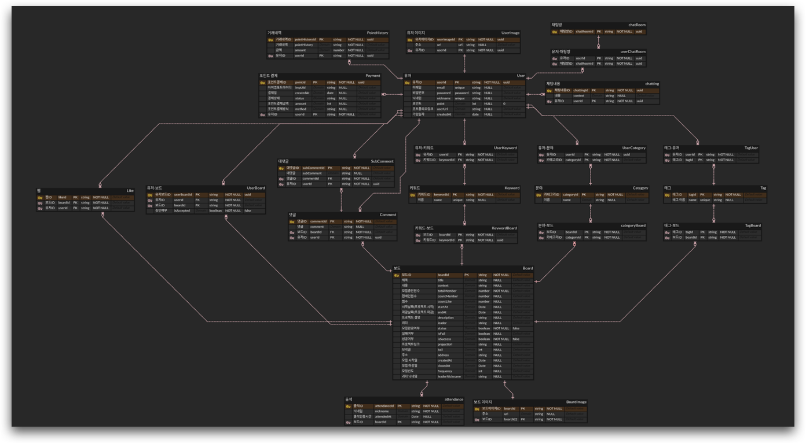

  

 

“ with it! do it! exit it! “  
프로젝트 / 스터디 구인 서비스 <strong>exit</strong>🏃‍♂️

 

<h2> ✅ 사이드 프로젝트를 함께 진행하고 싶을때?</h2>

대학생, 취준생들이 사이드 프로젝트 개발을 하고자 할 때 팀원들을 구하기 쉽도록 해주는 서비스를 제공하고자 합니다.

지금 시중에 나와있는 개발을 위해 사람을 모아주는 사이트들은 경력자나 스타트업을 다니는 개발자들을 위주로 만들어져 있습니다.

따라서 다른 서비스들과의 차별점으로 학교에서는 팀플과 졸업작품 등 외에는 팀 단위로 개발을 한 경험이 많이 없는 대학생들 또는 주변에서 기획, 디자인, 그리고 개발을 위한 팀 멤버들을 찾지 못한 대학생들을 주 타깃층으로 잡고 있습니다.

그래서 저희는 대학생들에게 친절한 서비스로 만들어서 진입장벽을 낮추고 이 서비스를 이용함으로써 많은 대학생 이용자들이 취업에 성공하는 것을 목표로 하고 있습니다.

사용자들의 취준생으로부터 ‘탈출’의 의미로 ‘EXIT’로 정하게 되었습니다.

<h2>✅ 프로젝트 차별성</h2>

<h2>✅ 팀원 소개</h2>

| 이름   | 역할                 | 작업 부분                                                                       |
| ------ | -------------------- | ------------------------------------------------------------------------------- |
| 주준휘 | 프론트엔드           | 로그인/회원가입, 메인페이지, 완료된 리스트/디테일, GPS, 관심항목/기술스택, 검색 |
| 김광욱 | 프론트엔드           | 유저리스트/디테일, 프로젝트 디테일, 채팅, 마이페이지/수정, 결제                 |
| 윤이소 | 프론트엔드           | 프로젝트 생성, 수정                                                             |
| 조성민 | 백엔드,팀장          | 프로젝트 CRUD                                                                   |
| 인영교 | 백엔드, Git & Github | 채팅, GPS, 검색(elastic-search), 로그인, 배포(GCP), Redis                       |
| 신채림 | 백엔드               | 소셜 로그인, 유저 CRUD, 이미지                                                  |

<h2>✅ 기술 스택</h2>

<h2>✅ 플로우 차트</h2>

<h2>✅ ERD</h2>

<h2>✅ API 역할분담</h2>

| 페이지                                               | API                                                     | 기능설명                                                                  | 담당   |
| ---------------------------------------------------- | ------------------------------------------------------- | ------------------------------------------------------------------------- | ------ |
| 메인페이지                                           | fetchBoards                                             | 프로젝트 보여주기                                                         | 조성민 |
|                                                      | fetchBoardsByLikes                                      | 인기 프로젝트 보여주기                                                    | 조성민 |
| 로그인 페이지                                        | login                                                   | 로그인하기                                                                | 인영교 |
|                                                      | googleLogin                                             | 구글 로그인하기                                                           | 신채림 |
|                                                      | kakaoLogin                                              | 카카오 로그인하기                                                         | 신채림 |
|                                                      | naverLogin                                              | 네이버 로그인하기                                                         | 신채림 |
| 비밀번호 찾기 페이지                                 | sendPasswordEmailToken                                  | 토큰보내기                                                                | 인영교 |
|                                                      | checkEmailToken                                         | 토큰확인하기                                                              | 인영교 |
|                                                      | checkEmailToken                                         | 랜덤한 비밀번호 만들어서 이메일로 전송하기                                | 인영교 |
|                                                      | updatePassword                                          | 재설정한 비밀번호 저장하기                                                | 인영교 |
| 회원가입 페이지                                      | checkEmailDuplicate                                     | 이메일 중복확인하기                                                       | 인영교 |
|                                                      | sendSignupEmailToken                                    | 가입할 이메일에 인증번호 전송하기                                         | 인영교 |
|                                                      | createUser                                              | 유저 정보 등록하기                                                        | 신채림 |
| 가입 후 관심항목 페이지                              | updateUser                                              | 체크된 기술/언어 저장하기                                                 | 인영교 |
| 마이페이지                                           | createUserImage                                         | 이미지 선택 버튼을 부르면 유저 이미지 저장하기                            | 신채림 |
|                                                      | removeUserImage                                         | 유저 이미지 삭제하기                                                      | 신채림 |
|                                                      | updatePassword                                          | 비밀번호 변경하기(bcrypt 적용)                                            | 인영교 |
|                                                      | updateUser                                              | 수정된 유저정보 저장하기 (업데이트 버튼)                                  | 인영교 |
|                                                      | removeUser                                              | 회원 탈퇴하기(soft delete)                                                | 신채림 |
|                                                      | fetchProjectsOfUser                                     | 유저가 참여한 프로젝트 히스토리 보여주기                                  | 신채림 |
|                                                      | fetchProjectOfUser                                      | 유저가 진행중인 프로젝트 보여주기                                         | 신채림 |
|                                                      | createUserUrl                                           | 깃헙, 블로드 등등 주소 등록하기                                           | 조성민 |
|                                                      | fetchLikes(userId)                                      | 내가 찜한 프로젝트 보여주기                                               | 조성민 |
|                                                      | createPayment                                           | 포인트 충전하기                                                           | 인영교 |
|                                                      | createCancel                                            | 환급받기                                                                  | 인영교 |
|                                                      | fetchUser(userId or email)                              | 유저 내역 보여주기                                                        | 신채림 |
|                                                      | fetchPayments                                           | 포인트 충전 내역 보여주기                                                 | 인영교 |
| 프로젝트 생성(작성) 페이지                           | createBoard                                             | 작성한 프로젝트 정보를 저장하기                                           | 조성민 |
|                                                      | createBoardImage                                        | 프로젝트 이미지 업로드하기                                                | 신채림 |
| 프로젝트 생성(수정) 페이지                           | fetchBoard(boardId)                                     | 기존에 작성한 프로젝트 정보 보여주기                                      | 조성민 |
|                                                      | updateBoard                                             | 작성한 프로젝트 수정 정보를 저장하기                                      | 조성민 |
|                                                      | createBoardImage                                        | 프로젝트 이미지 업로드하기                                                | 신채림 |
| 디테일 페이지(팀장)                                  | fetchBoard(boardId)                                     | 프로젝트 정보 보여주기                                                    | 조성민 |
|                                                      | updateBoard                                             | 모집 마감하기 버튼을 누르면 모집상태 status 변경하기                      | 조성민 |
|                                                      | fetchUsers                                              | 프로젝트 신청한 유저들 보여주기                                           | 신채림 |
|                                                      | createOrDeleteLike                                      | 유저가 프로젝트의 찜하기                                                  | 조성민 |
|                                                      | fetchUserBoards(boardId, isAccepted)                    | 프로젝트 지원한 유저들 목록 보여주기                                      | 조성민 |
|                                                      | updateUserBoard                                         | 지원자 수락, 취소                                                         | 조성민 |
|                                                      | fetchLike                                               | 관심지수(찜) 보여주기                                                     | 조성민 |
|                                                      | removeBoard(boardId)                                    | 프로젝트 삭제(soft delete)                                                | 조성민 |
|                                                      | updateBoard                                             | 프로젝트 종료하기 버튼을 누르면 성공여부 isSuccess 바꾸기                 | 조성민 |
| 디테일 페이지(팀장 외)                               | fetchBoard(boardId)                                     | 프로젝트 정보 보여주기                                                    | 조성민 |
|                                                      | fetchLoginedUser                                        | 아바타(유저 마이페이지) 이미지 보여주기                                   | 신채림 |
|                                                      | fetchLoginedUser                                        | 팀장 정보 보여주기                                                        | 인영교 |
|                                                      | fetchLike                                               | 관심지수(찜) 보여주기                                                     | 조성민 |
|                                                      | createRoom                                              | 채팅방만들기                                                              | 인영교 |
|                                                      | connectionRoom                                          | 채팅방이 있다면 연결시켜주기                                              | 인영교 |
|                                                      | createUserBoard(userId, boardId)                        | 신청하기 버튼을 누르면 신청한 유저의 정보를 해당 프로젝트 정보에 저장하기 | 조성민 |
|                                                      | removeUserBoard                                         | 신청 취소하기 버튼                                                        | 조성민 |
|                                                      | createOrDeleteLike                                      | 유저가 프로젝트의 찜하기                                                  | 조성민 |
| 프로젝트 리스트 페이지                               | fetchBoard(boardId)                                     | 특정 프로젝트 보여주기 ( 분야로 추천? )                                   | 조성민 |
|                                                      | fetchBoardsByLikes                                      | 인기 프로젝트 보여주기                                                    | 조성민 |
|                                                      | fetchBoards, fetchTag(tagId), fetchCategory(categoryId) | 프로젝트 리스트 보여주기 ( 조건 )                                         | 조성민 |
| 완료한 프로젝트 리스트 페이지                        | fetchBoards(isSuccess)                                  | 완료한 프로젝트 리스트 보여주기                                           | 조성민 |
| 완료한 프로젝트 리스트 디테일 페이지                 | fetchBoard(boardId)                                     | 프로젝트(보드)이미지 보여주기                                             | 조성민 |
|                                                      | fetchBoard(boardId)                                     | 프로젝트 정보 보여주기                                                    | 조성민 |
|                                                      | createComment                                           | 유저가 입력한 댓글 저장하기                                               | 조성민 |
|                                                      | fetchComments                                           | 댓글 보여주기                                                             | 조성민 |
|                                                      | updateComment                                           | 댓글 수정하기                                                             | 조성민 |
|                                                      | removeComment                                           | 댓글 삭제하기                                                             | 조성민 |
|                                                      | createSubComment                                        | 프로젝트 참여자가 입력한 대댓글 저장하기                                  | 조성민 |
|                                                      | fetchSubComments                                        | 대댓글 보여주기                                                           | 조성민 |
|                                                      | updateSubComment                                        | 대댓글 수정하기                                                           | 조성민 |
|                                                      | removeSubComment                                        | 대댓글 삭제하기                                                           | 조성민 |
|                                                      | downloadBoard                                           | 프로젝트 zip 파일 저장해놓은 url 불러오기                                 | 신채림 |
| 디테일 페이지(팀장) => 프로젝트 종료하기 클릭 시(예) | updateBoard                                             | 등록하기 버튼(예)를 누르면 완료한 프로젝트로 변경하기                     | 조성민 |
|                                                      | uploadBoard                                             | 성공한 프로젝트 zip 파일 업로드하기                                       | 신채림 |
| 채팅하기                                             | fetchLogs                                               | 대화 목록(참여한 채팅방)보여주기                                          | 인영교 |
|                                                      | createChatRoom                                          | 채팅방 만들기                                                             | 인영교 |
|                                                      |                                                         | 채팅 내용 저장하기(채팅할때 저장됨)                                       | 인영교 |
|                                                      | chat\*                                                  | 채팅 참여 유저 정보 보여주기                                              | 인영교 |
|                                                      | fetchUser                                               | 유저 정보 보여주기                                                        | 신채림 |
| 유저 정보 페이지                                     | fetchUsers                                              | 유저 목록 보여주기                                                        | 신채림 |
|                                                      | fetchUserRandom                                         | 오늘의 픽 보여주기(랜덤한 유저) ->랜덤유저의 진행중인 프로젝트 보여주기   | 인영교 |
| 유저 정보 디테일 페이지                              | fetchUserwithEmail 또는 fetchUserwithId                 | 특정 유저의 디테일 보여주기                                               | 인영교 |
| 팀장 페이지(프로젝트 관리자)-출석관리 페이지         | getLocationLeader                                       | 리더가 출석을 활성화 했을 떄의 위치 정보를 보여주기                       | 인영교 |
|                                                      | checkGps                                                | 출석 체크                                                                 | 인영교 |
| 팀원 페이지-출석 페이지                              | getLocationCrew                                         | 팀원의 위치 정보 보여주기                                                 | 인영교 |
|                                                      | checkGps                                                | 출석 체크                                                                 | 인영교 |
